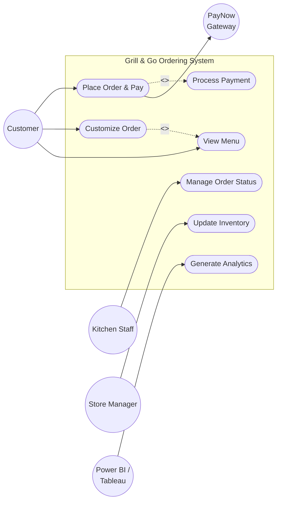

# User Requirements Specification (URS)
**Project:** Grill & Go Digital Ordering System    
 
## 1. Agile User Stories & BDD Acceptance Criteria
 
### Customer Role
**US-01: View Digital Menu via QR Code**
*As a Customer, I want to scan a table QR code and view the menu on my mobile browser so that I can see available items without downloading an app.*
* **Given** I am seated at a table with a unique QR code.
* **When** I scan the QR code using my mobile phone camera.
* **Then** I am redirected to a mobile-optimized web menu displaying available items, prices, and descriptions.
 
**US-02: Customize and Submit Order**
*As a Customer, I want to customize my meal (e.g., steak doneness) and submit my order so that the kitchen knows my exact preferences.*
* **Given** I have selected items from the digital menu
* **When** I choose my customizations (side dishes, doneness) and click "Submit Order"
* **Then** the system calculates the total and prompts me for immediate payment.
 
**US-03: Pay via PayNow or Credit Card**
*As a Customer, I want to pay immediately via PayNow or Credit Card so that my order is confirmed and sent to the kitchen.*
* **Given** I have reviewed my order total on the checkout screen
* **When** I complete the payment via PayNow QR or Credit Card integration
* **Then** the system confirms payment success and transmits the order to the Kitchen Display System (KDS).
 
### Kitchen Staff Role
**US-04: Manage Order Status on KDS**
*As a Kitchen Staff, I want to view incoming paid orders on the KDS tablet and update their status so that I can manage the cooking workflow efficiently.*
* **Given** a new paid order is received by the system
* **When** I view the KDS tablet and update the status from "Pending" → "Preparing" → "Ready for Pickup"
* **Then** the order status updates in real-time, and the order moves to the appropriate queue column.
 
### Store Manager Role
**US-05: Toggle Menu Item Availability**
*As a Store Manager, I want to quickly toggle menu items as "Out of Stock" so that customers cannot order unavailable items during peak hours.*
* **Given** a specific ingredient or menu item runs out
* **When** I use the manager operational override to mark the item as "Out of Stock"
* **Then** the item is immediately hidden or greyed out on the customer mobile menu in real-time.
 
**US-06: Leverage BI Tools for Analytics**
*As a Store Manager, I want the transactional database to be directly accessible by Power BI/Tableau so that I can track revenue and peak-hour sales without manual reporting.*
* **Given** the system is processing daily transactions
* **When** I open Power BI connected directly to the transactional database
* **Then** I can view real-time dashboards on revenue, average order value, and peak-hour order volumes.
 
---
 
## 2. UML Use Case Diagram
 

---

## 3. Document Approval & Client Sign-Off

By signing below, the undersigned parties acknowledge that they have reviewed, understood, and approved the user requirements and scope detailed within this User Requirements Specification (URS) document.

| Approval Role | Stakeholder Name | Organization/ Position | Approval Status | Timestamp (SGT) | Digital Sign-Off (Git ID) |
| :--- | :--- | :--- | :--- | :--- | :--- |
| **Client/ Business Owner** | Uncle Bob | Owner, Grill & Go (Orchard Road) | **APPROVED** | 2026-10-04 14:52 | `@unclebob-grillgo` |

