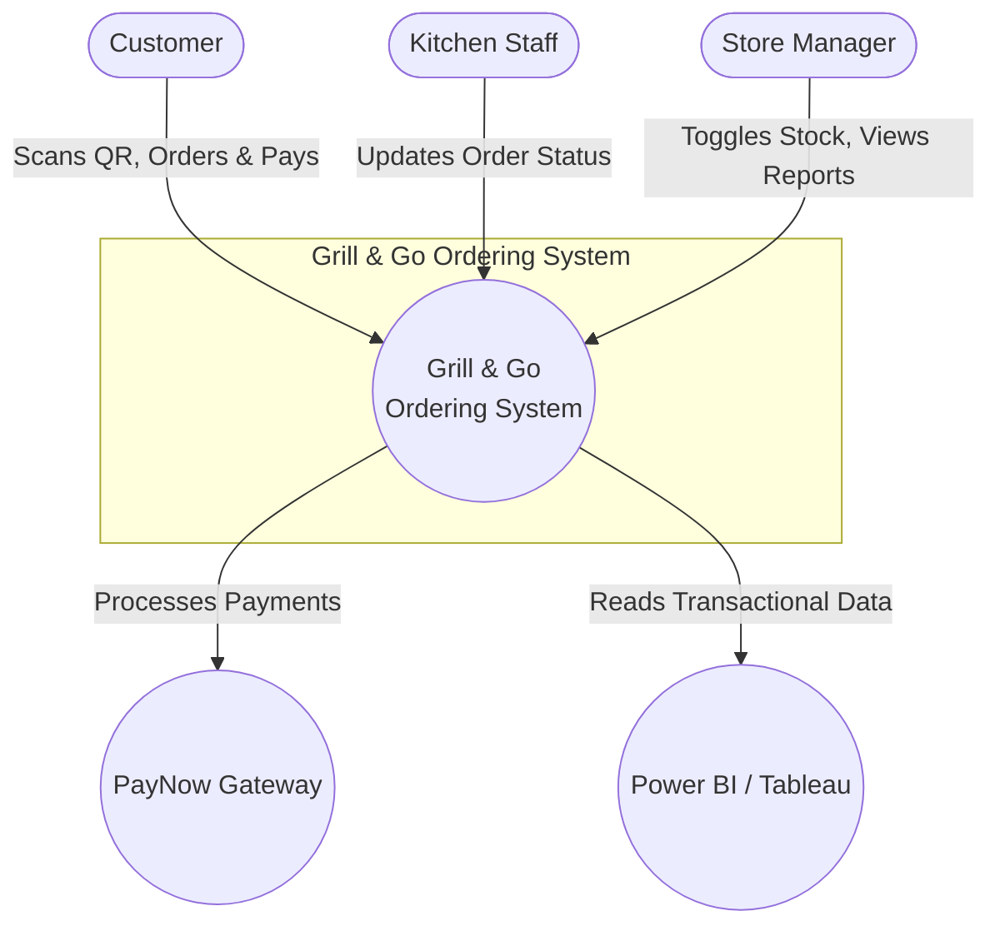
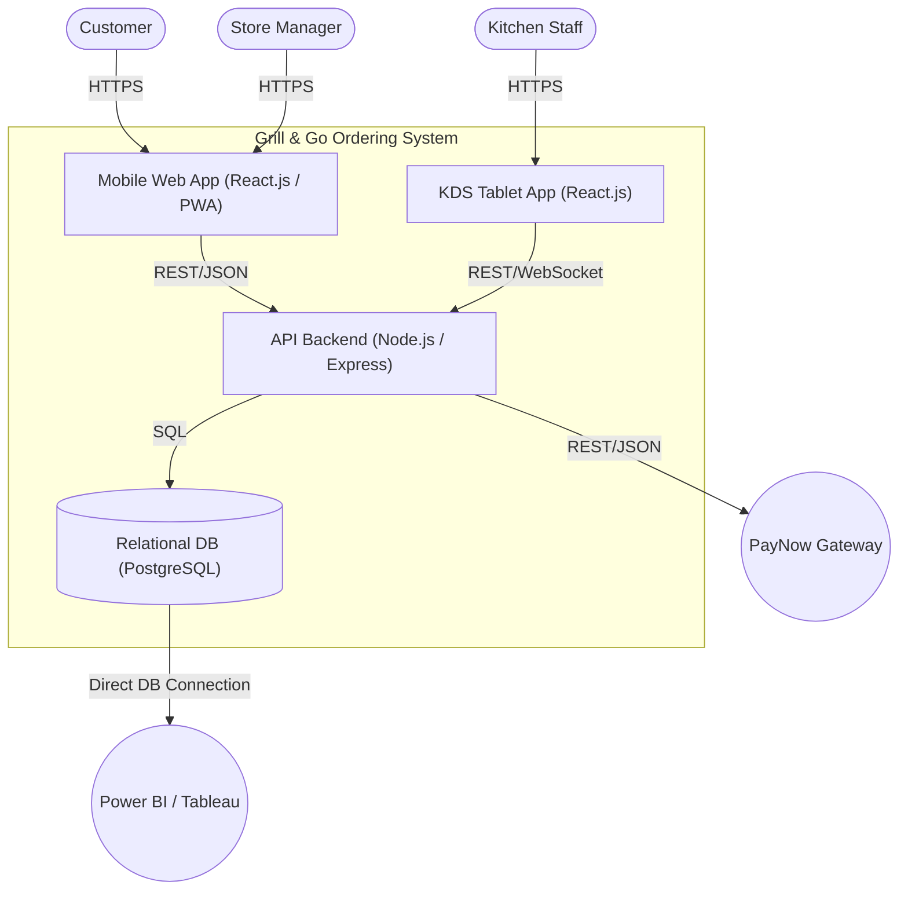
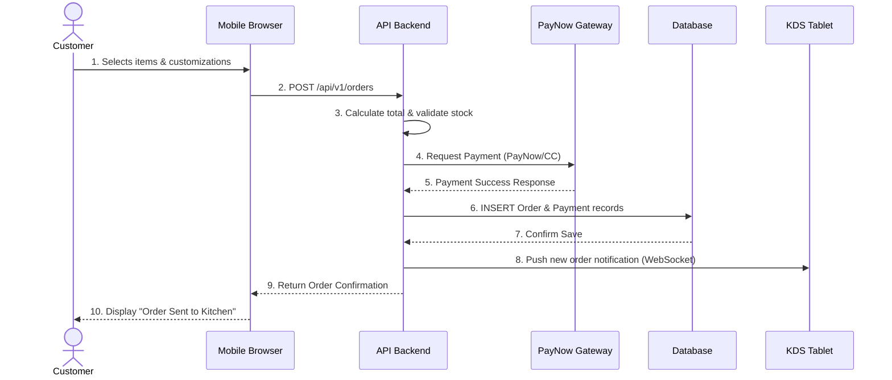
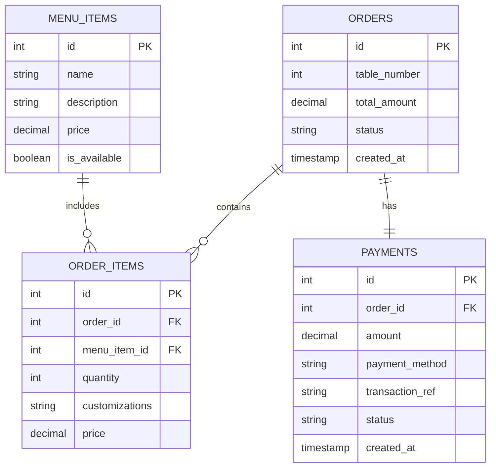

# Technical Design Specification (TDS)
**Project:** Grill & Go Digital Ordering System  

## 1. C4 Architecture Model

### C1: System Context Diagram
High-level view showing human actors, system boundaries, and external integrations.



### C2: Container Diagram
Technology stack choices and internal system containers.



---

## 2. UML Sequence Diagram (Order Placement & PayNow Flow)



---

## 3. Database Schema (ERD)



---

## 4. API Interface Specifications

### Endpoint 1: Place Order
**`POST /api/v1/orders`**
*Description: Creates a new order and processes immediate payment.*

**Request Payload:**
```json
{
  "table_number": 5,
  "items": [
    {
      "menu_item_id": 101,
      "quantity": 2,
      "customizations": "Medium rare, no onions"
    }
  ],
  "payment_method": "PAYNOW",
  "payment_token": "txn_123456789"
}
```

**Response Payload:**
```json
{
  "order_id": 9001,
  "status": "PAID_PENDING_KITCHEN",
  "total_amount": 45.50,
  "payment_status": "SUCCESS",
  "estimated_prep_time_mins": 15
}
```

### Endpoint 2: Update Inventory (Out of Stock Override)
**`PATCH /api/v1/menu/items/{item_id}`**
*Description: Allows Store Manager to toggle item availability in real-time.*

**Request Payload:**
```json
{
  "is_available": false
}
```

**Response Payload:**
```json
{
  "menu_item_id": 101,
  "name": "Ribeye Steak",
  "is_available": false,
  "updated_at": "2026-10-12T14:30:00Z"
}
```

---

## 5. Requirements Traceability Matrix (RTM)

| Raw Req ID | Business Requirement | User Story | Use Case | API / DB Component |
| :--- | :--- | :--- | :--- | :--- |
| **BR-01** | Customers scan QR to order without app download | US-01 | View Menu, Customize Order | Mobile Web App, `menu_items` table |
| **BR-02** | Immediate payment via PayNow/CC prior to kitchen transmission | US-02, US-03 | Place Order & Pay, Process Payment | `POST /api/v1/orders`, `payments` table |
| **BR-03** | Kitchen views orders on KDS tablet and updates status | US-04 | Manage Order Status | KDS Tablet App, `orders` table |
| **BR-04** | Store Manager toggles "Out of Stock" in real-time | US-05 | Update Inventory | `PATCH /api/v1/menu/items/{id}`, `menu_items` |
| **BR-05** | Power BI/Tableau connects directly to DB for analytics | US-06 | Generate Analytics | Direct DB connection to PostgreSQL |
| **BR-06** | System handles ~30,000 monthly transactions & 100 concurrent sessions | NFR-01 | N/A | API Backend Load Balancing, DB Indexing |

---

## 6. Non-Functional Requirements (NFRs)

1. **Performance:** The API backend must handle peak bursts of up to **100 concurrent mobile browser sessions** with a maximum response time of **< 200ms** for menu loading and **< 500ms** for order placement.
2. **Scalability:** The relational database must be optimized to support **~30,000 monthly transactions** (~1,000/day) without query degradation, utilizing proper indexing on `orders.created_at` and `menu_items.id`.
3. **Security:** All payment data must be processed via the PCI-DSS compliant PayNow Gateway. **No raw credit card data** shall be stored in the transactional database. Manager and KDS endpoints must be secured via HTTPS and JWT Role-Based Access Control (RBAC).
4. **Availability:** The system must guarantee **99.9% uptime** during peak operating hours (12 PM – 2 PM and 6 PM – 9 PM).
5. **Integration:** The PostgreSQL database must expose a read-replica or direct connection string specifically for Power BI/Tableau to ensure BI queries do not impact transactional write performance.

---

## 7. Document Approval & Technical Sign-Off

By signing below, the undersigned engineering leads acknowledge that the architecture, schema, and API specifications detailed within this Technical Design Specification (TDS) are technically feasible, scalable to 30,000 monthly transactions, and approved for implementation.

| Approval Role | Engineer Name | Project Role | Approval Status | Timestamp (SGT) | Digital Sign-Off (Git ID) |
| :--- | :--- | :--- | :--- | :--- | :--- |
| **Lead Systems Analyst** | [Your Name] | Systems Analyst/ Author | **APPROVED** | 2026-10-12 16:00 | `@your-github-username` |
| **Lead Software Engineer** | [Teammate 2 Name] | Software Architect/ Lead Developer | **APPROVED** | 2026-10-12 16:15 | `@teammate2-username` |
