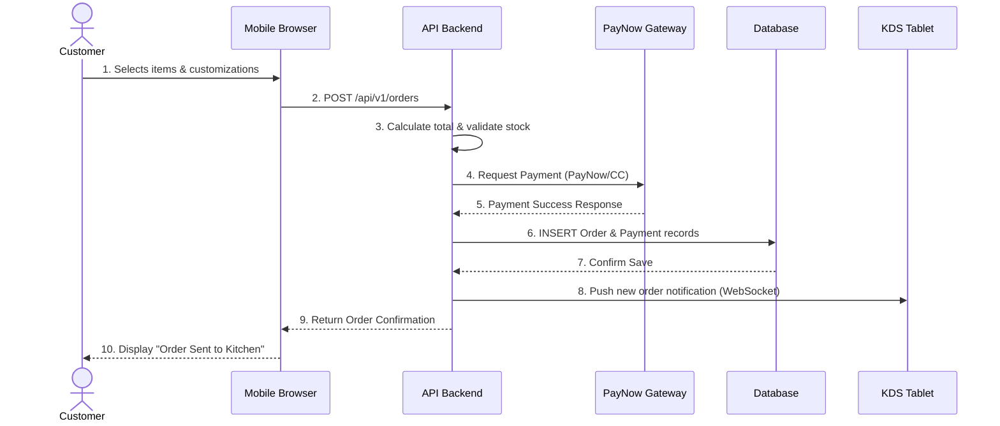
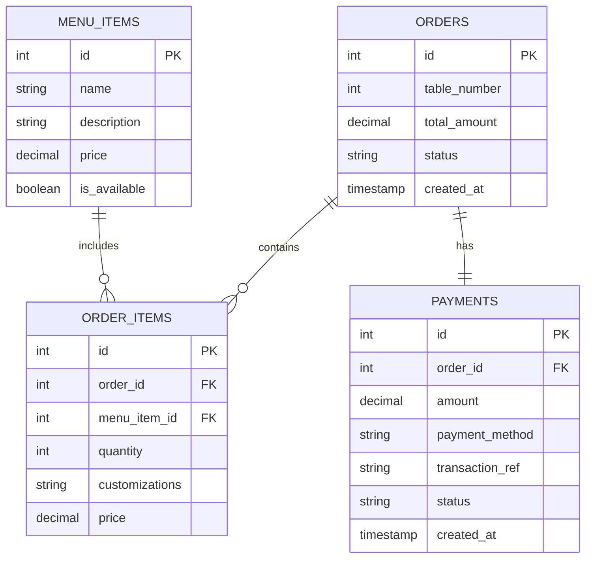

# Technical Design Specification (TDS)
**Project:** Grill & Go Digital Ordering System  

## 1. C4 Architecture Model

### C1: System Context Diagram
High-level view showing human actors, system boundaries, and external integrations.


### C2: Container Diagram
Technology stack choices and internal system containers.


---

## 2. UML Sequence Diagram (Order Placement & PayNow Flow)



---

## 3. Database Schema (ERD)




## 4. API Interface Specifications

### Endpoint 1: Place Order
**`POST /api/v1/orders`**
*Description: Creates a new order and processes immediate payment.*

**Request Payload:**
```json
{
  "table_number": 5,
  "items": [
    {
      "menu_item_id": 101,
      "quantity": 2,
      "customizations": "Medium rare, no onions"
    }
  ],
  "payment_method": "PAYNOW",
  "payment_token": "txn_123456789"
}
```

**Response Payload:**
```json
{
  "order_id": 9001,
  "status": "PAID_PENDING_KITCHEN",
  "total_amount": 45.50,
  "payment_status": "SUCCESS",
  "estimated_prep_time_mins": 15
}
```

### Endpoint 2: Update Inventory (Out of Stock Override)
**`PATCH /api/v1/menu/items/{item_id}`**
*Description: Allows Store Manager to toggle item availability in real-time.*

**Request Payload:**
```json
{
  "is_available": false
}
```

**Response Payload:**
```json
{
  "menu_item_id": 101,
  "name": "Ribeye Steak",
  "is_available": false,
  "updated_at": "2026-10-12T14:30:00Z"
}
```

---

## 5. Document Approval & Technical Sign-Off

By signing below, the undersigned engineering leads acknowledge that the architecture, schema, and API specifications detailed within this Technical Design Specification (TDS) are technically feasible, scalable to 30,000 monthly transactions, and approved for implementation.

| Approval Role | Engineer Name | Project Role |  Timestamp (SGT) | Digital Sign-Off (Git ID) |
| :--- | :--- | :--- | :--- | :--- | 
| **Lead Systems Analyst** | Kaveesha Lakruwan |  **APPROVED** | 2026-10-05 16:00 | @lakruwanb2004-lgtm |
| **Lead Software Engineer** |  Lesandu Dulneth | **APPROVED** | 2026-10-05 16:15 |  @lesandudulneth-cloud  |
